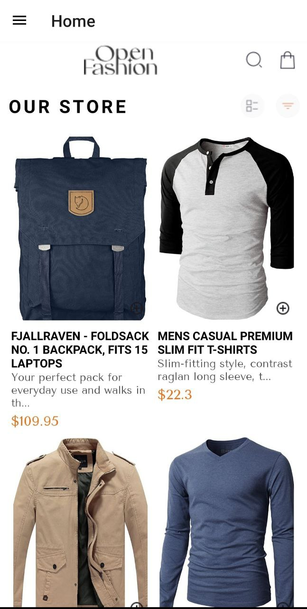

# DCIT 207 ASSIGNMENT

## 11263775

## Introduction:
This is a mobile application developed using React Native that serves as an e-commerce platform. The app allows users to browse products, view product details and add items to their cart.

## Screens:
### HomeScreen:
 Displays a list of products being osold on the app. Users can add products to the cart from this screen.

### ProductDetailScreen: 
Displays detailed information about a product. Users can add the product to the cart from this screen.

### CartScreen:
Displays the list of products added to the cart and allows users to remove items or proceed to checkout.

## Design choices:
### React Navigation: 
I used react navigation to implement a drawer-based navigation system. This allows users to easily access different sections of the app through a side menu, enhancing usability and organization.

## Data Storage Implementation:
### AsyncStorage
 AsyncStorage from React Native was used for  storage. This allows the app to store key-value pairs locally on the device, ensuring that important data is preserved between sessions.

